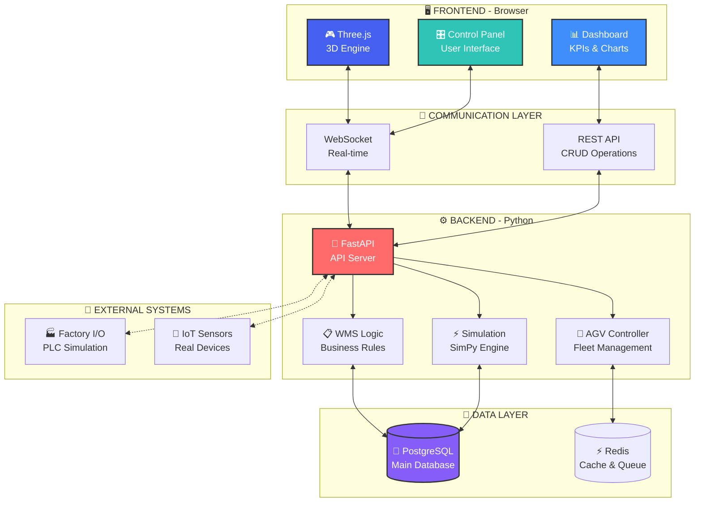
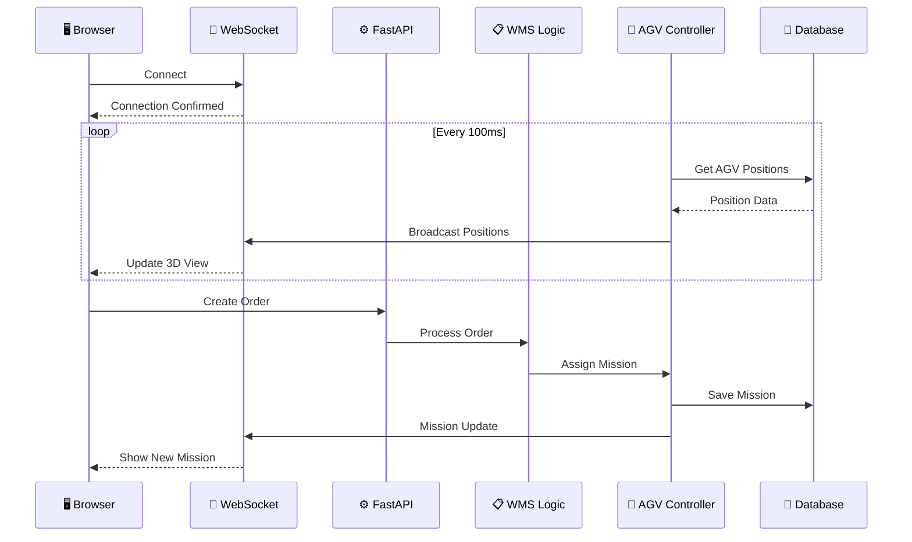
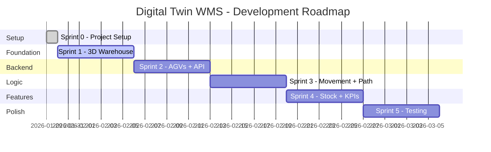
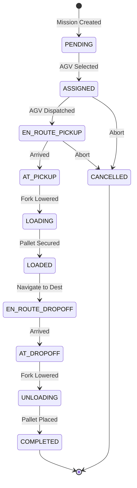

<div align="center">

```
██████╗ ██╗ ██████╗ ██╗████████╗ █████╗ ██╗         ████████╗██╗    ██╗██╗███╗   ██╗
██╔══██╗██║██╔════╝ ██║╚══██╔══╝██╔══██╗██║         ╚══██╔══╝██║    ██║██║████╗  ██║
██║  ██║██║██║  ███╗██║   ██║   ███████║██║            ██║   ██║ █╗ ██║██║██╔██╗ ██║
██║  ██║██║██║   ██║██║   ██║   ██╔══██║██║            ██║   ██║███╗██║██║██║╚██╗██║
██████╔╝██║╚██████╔╝██║   ██║   ██║  ██║███████╗       ██║   ╚███╔███╔╝██║██║ ╚████║
╚═════╝ ╚═╝ ╚═════╝ ╚═╝   ╚═╝   ╚═╝  ╚═╝╚══════╝       ╚═╝    ╚══╝╚══╝ ╚═╝╚═╝  ╚═══╝
                                                                                     
██╗    ██╗███╗   ███╗███████╗
██║    ██║████╗ ████║██╔════╝
██║ █╗ ██║██╔████╔██║███████╗
██║███╗██║██║╚██╔╝██║╚════██║
╚███╔███╔╝██║ ╚═╝ ██║███████║
 ╚══╝╚══╝ ╚═╝     ╚═╝╚══════╝
```

# 🏭 Digital Twin for Warehouse Management System

### *Real-time 3D visualization of warehouse operations with AGV fleet management*

[](https://github.com/Mehdi007bond/Projet_Digital_twin_WMS)
[](https://github.com/Mehdi007bond/Projet_Digital_twin_WMS)
[](LICENSE)
[](https://threejs.org/)
[](https://python.org/)
[](https://fastapi.tiangolo.com/)

---

**🇬🇧 English** | **🇫🇷 Français**

*A comprehensive Digital Twin solution for modern warehouse management, featuring real-time 3D visualization, AGV fleet control, and advanced KPI tracking.*

*Une solution complète de Jumeau Numérique pour la gestion d'entrepôt moderne, avec visualisation 3D en temps réel, contrôle de flotte AGV et suivi avancé des KPIs.*

---

[🚀 Getting Started](#-getting-started) •
[📖 Documentation](#-documentation) •
[🎮 Demo](#-demo) •
[📊 KPIs](#-kpis--metrics) •
[🤝 Contributing](#-contributing)

</div>

---

## 📋 Table of Contents

- [📖 About The Project](#-about-the-project)
- [✨ Key Features](#-key-features)
- [🏗️ System Architecture](#️-system-architecture)
- [🎮 3D Digital Twin Features](#-3d-digital-twin-features)
- [📊 KPIs & Metrics](#-kpis--metrics)
- [🗺️ Project Roadmap](#️-project-roadmap)
- [📁 Project Structure](#-project-structure)
- [🛠️ Tech Stack](#️-tech-stack)
- [🚀 Getting Started](#-getting-started)
- [📈 Stock Management](#-stock-management)
- [🤖 AGV System](#-agv-system)
- [🔗 API Documentation](#-api-documentation)
- [🧪 Testing](#-testing)
- [🤝 Contributing](#-contributing)
- [📜 License](#-license)
- [👥 Team](#-team)
- [🙏 Acknowledgments](#-acknowledgments)

---

## 📖 About The Project

<div align="center">

### 🎯 Vision

*Transform warehouse operations through intelligent visualization and automation*

</div>

The **Digital Twin WMS** project creates a real-time, interactive 3D replica of a warehouse environment. This digital twin synchronizes with actual warehouse operations, providing:

| Goal | Description |
|------|-------------|
| 🔍 **Visibility** | Complete real-time view of all warehouse operations |
| 🤖 **Automation** | Intelligent AGV fleet management and optimization |
| 📊 **Analytics** | Comprehensive KPI tracking and performance analysis |
| 🎯 **Optimization** | Data-driven decision making for improved efficiency |
| 🔮 **Simulation** | Test scenarios before real-world implementation |

### 🌟 Why Digital Twin for WMS?

```
┌─────────────────────────────────────────────────────────────────────────┐
│                                                                          │
│    📦 TRADITIONAL WAREHOUSE          🏭 DIGITAL TWIN WAREHOUSE          │
│    ─────────────────────────         ──────────────────────────          │
│                                                                          │
│    ❌ Limited visibility             ✅ 360° real-time view              │
│    ❌ Reactive decisions             ✅ Proactive optimization           │
│    ❌ Manual AGV coordination        ✅ AI-powered fleet control         │
│    ❌ Delayed KPI reporting          ✅ Instant performance metrics      │
│    ❌ Risky change testing           ✅ Safe simulation environment      │
│                                                                          │
└─────────────────────────────────────────────────────────────────────────┘
```

---

## ✨ Key Features

<table>
<tr>
<td width="50%">

### 🏭 3D Warehouse Visualization
- Photorealistic warehouse rendering
- Real-time stock level display
- Zone-based color coding
- Interactive camera controls
- Day/night lighting modes

</td>
<td width="50%">

### 🤖 AGV Fleet Management
- Real-time AGV tracking
- Intelligent path planning (A*)
- Collision avoidance system
- Mission queue optimization
- Battery management

</td>
</tr>
<tr>
<td width="50%">

### 📦 Stock Management
- Live inventory tracking
- FIFO/LIFO/ABC strategies
- Low stock alerts
- Location optimization
- Pallet visualization

</td>
<td width="50%">

### 📊 KPI Dashboard
- Real-time performance metrics
- Historical trend analysis
- Customizable alerts
- Export capabilities
- Comparison reports

</td>
</tr>
<tr>
<td width="50%">

### 🔄 Real-time Synchronization
- WebSocket live updates
- Sub-second latency
- Offline mode support
- Auto-reconnection
- Event logging

</td>
<td width="50%">

### 🎮 Simulation Mode
- Scenario testing
- What-if analysis
- Speed control (0.5x - 4x)
- Historical playback
- Performance prediction

</td>
</tr>
</table>

---

## 🏗️ System Architecture



### 📡 Data Flow



---

## 🎮 3D Digital Twin Features

### 🏭 Warehouse Environment

<table>
<tr>
<td width="33%" align="center">

**📐 Structure**
```
Dimensions: 50m × 30m
Height: 10m
Zones: 4
Dock Doors: 6
```

</td>
<td width="33%" align="center">

**💡 Lighting**
```
Ambient: Soft fill
Directional: Sun
Spotlights: Ceiling
Point lights: Accents
```

</td>
<td width="33%" align="center">

**🎨 Quality**
```
Shadows: PCFSoft
Anti-aliasing: FXAA
Tone mapping: ACES
Post-processing: ✓
```

</td>
</tr>
</table>

### 🗺️ Zone Layout

```
┌─────────────────────────────────────────────────────────────────────────┐
│                              WAREHOUSE LAYOUT                            │
├─────────────────────────────────────────────────────────────────────────┤
│                                                                          │
│  ┌──────────────┐                                    ┌──────────────┐   │
│  │              │                                    │              │   │
│  │  🟢 RECEPTION │   ═══════════════════════════    │ 🔵 EXPEDITION │   │
│  │    ZONE      │          MAIN AISLE               │    ZONE      │   │
│  │              │                                    │              │   │
│  └──────────────┘                                    └──────────────┘   │
│                                                                          │
│  ╔══════════╗  ╔══════════╗  ╔══════════╗  ╔══════════╗  ╔══════════╗  │
│  ║  RACK A1 ║  ║  RACK A2 ║  ║  RACK A3 ║  ║  RACK A4 ║  ║  RACK A5 ║  │
│  ╠══════════╣  ╠══════════╣  ╠══════════╣  ╠══════════╣  ╠══════════╣  │
│  ║▓▓▓▓▓▓▓▓▓▓║  ║▓▓▓▓░░░░░░║  ║▓▓▓▓▓▓▓▓▓▓║  ║░░░░░░░░░░║  ║▓▓▓▓▓▓░░░░║  │
│  ╠══════════╣  ╠══════════╣  ╠══════════╣  ╠══════════╣  ╠══════════╣  │
│  ║▓▓▓▓▓▓░░░░║  ║▓▓▓▓▓▓▓▓▓▓║  ║▓▓▓▓▓▓▓▓▓▓║  ║▓▓▓▓▓▓▓▓▓▓║  ║▓▓▓▓▓▓▓▓▓▓║  │
│  ╚══════════╝  ╚══════════╝  ╚══════════╝  ╚══════════╝  ╚══════════╝  │
│                           ═══════════════                                │
│  ╔══════════╗  ╔══════════╗  ╔══════════╗  ╔══════════╗  ╔══════════╗  │
│  ║  RACK B1 ║  ║  RACK B2 ║  ║  RACK B3 ║  ║  RACK B4 ║  ║  RACK B5 ║  │
│  ╠══════════╣  ╠══════════╣  ╠══════════╣  ╠══════════╣  ╠══════════╣  │
│  ║▓▓▓▓▓▓▓▓▓▓║  ║▓▓▓▓▓▓░░░░║  ║░░░░░░░░░░║  ║▓▓▓▓▓▓▓▓▓▓║  ║▓▓▓▓▓▓▓▓▓▓║  │
│  ╚══════════╝  ╚══════════╝  ╚══════════╝  ╚══════════╝  ╚══════════╝  │
│                           ═══════════════                                │
│  ╔══════════╗  ╔══════════╗  ╔══════════╗  ╔══════════╗  ╔══════════╗  │
│  ║  RACK C1 ║  ║  RACK C2 ║  ║  RACK C3 ║  ║  RACK C4 ║  ║  RACK C5 ║  │
│  ╠══════════╣  ╠══════════╣  ╠══════════╣  ╠══════════╣  ╠══════════╣  │
│  ║▓▓▓▓▓▓▓▓▓▓║  ║▓▓▓▓▓▓▓▓▓▓║  ║▓▓▓▓▓▓▓▓▓▓║  ║▓▓▓▓░░░░░░║  ║▓▓▓▓▓▓▓▓▓▓║  │
│  ╚══════════╝  ╚══════════╝  ╚══════════╝  ╚══════════╝  ╚══════════╝  │
│                                                                          │
│  ┌─────────────────────────────────────────────────────────────────┐    │
│  │  ⚡ CHARGING ZONE    🤖 AGV-001    🤖 AGV-002    🤖 AGV-003     │    │
│  │  ████████████████        🔵            🟢            🟡         │    │
│  └─────────────────────────────────────────────────────────────────┘    │
│                                                                          │
│  Legend: ▓▓ = Stock Present  ░░ = Empty  🟢 = Ready  🔵 = Moving  🟡 = Charging │
│                                                                          │
└─────────────────────────────────────────────────────────────────────────┘
```

### 🤖 AGV 3D Model Details

```
┌─────────────────────────────────────────────────────────────────────────┐
│                            AGV MODEL SPECIFICATIONS                      │
├─────────────────────────────────────────────────────────────────────────┤
│                                                                          │
│                        ┌─────────────────┐                               │
│                        │   📡 LIDAR      │                               │
│                        │   ┌───────┐     │                               │
│                        │   │  ◉◉◉  │     │  ← Safety sensors             │
│              ┌─────────┴───┴───────┴─────┴─────────┐                    │
│              │  ╔═══════════════════════════════╗  │                    │
│              │  ║     STATUS LED STRIP          ║  │ ← 🟢🔵🟡🔴         │
│              │  ╠═══════════════════════════════╣  │                    │
│              │  ║                               ║  │                    │
│     ┌────────┤  ║    MAIN BODY (1.2m × 0.8m)   ║  ├────────┐           │
│     │ WHEEL  │  ║         Dark Gray            ║  │ WHEEL  │           │
│     │  ●●    │  ║                               ║  │   ●●   │           │
│     └────────┤  ╠═══════════════════════════════╣  ├────────┘           │
│              │  ║     DISPLAY / SCREEN          ║  │                    │
│              │  ╚═══════════════════════════════╝  │                    │
│              └─────────────────────────────────────┘                    │
│                        │                 │                               │
│                   ┌────┴────┐       ┌────┴────┐                         │
│                   │  FORK   │       │  FORK   │  ← Yellow, animated     │
│                   │ ════════│       │════════ │                         │
│                   └─────────┘       └─────────┘                         │
│                                                                          │
│  Dimensions: 1.2m (L) × 0.8m (W) × 0.3m (H) + forks                     │
│  Wheels: 4× rubber, animated rotation                                   │
│  Forks: Lifting animation (0 - 1.5m)                                    │
│  Lights: Status LEDs, headlights, tail lights                           │
│                                                                          │
└─────────────────────────────────────────────────────────────────────────┘
```

---

## 📊 KPIs & Metrics

### 📦 Stock KPIs

<table>
<tr>
<th width="25%">KPI</th>
<th width="35%">Description</th>
<th width="20%">Formula</th>
<th width="20%">Target</th>
</tr>
<tr>
<td>📈 <b>Stock Rotation</b></td>
<td>How often inventory turns over</td>
<td>COGS / Avg Inventory</td>
<td>> 12 turns/year</td>
</tr>
<tr>
<td>📊 <b>Fill Rate</b></td>
<td>Warehouse capacity utilization</td>
<td>Used Locations / Total</td>
<td>75-85%</td>
</tr>
<tr>
<td>🎯 <b>Inventory Accuracy</b></td>
<td>System vs physical match</td>
<td>Accurate Items / Total</td>
<td>> 99%</td>
</tr>
<tr>
<td>⚠️ <b>Stockout Rate</b></td>
<td>Out of stock occurrences</td>
<td>Stockouts / Total SKUs</td>
<td>< 2%</td>
</tr>
<tr>
<td>⏱️ <b>Days in Stock</b></td>
<td>Average storage duration</td>
<td>Avg Inventory / Daily Use</td>
<td>< 30 days</td>
</tr>
</table>

### 🤖 AGV KPIs

<table>
<tr>
<th width="25%">KPI</th>
<th width="35%">Description</th>
<th width="20%">Formula</th>
<th width="20%">Target</th>
</tr>
<tr>
<td>⚡ <b>Utilization Rate</b></td>
<td>Active time percentage</td>
<td>Working Time / Available</td>
<td>> 80%</td>
</tr>
<tr>
<td>✅ <b>Missions Completed</b></td>
<td>Tasks finished per shift</td>
<td>Count per 8h</td>
<td>> 150/shift</td>
</tr>
<tr>
<td>⏱️ <b>Avg Mission Time</b></td>
<td>Time per task</td>
<td>Total Time / Missions</td>
<td>< 3 min</td>
</tr>
<tr>
<td>📍 <b>Distance Traveled</b></td>
<td>Total km per day</td>
<td>Sum of paths</td>
<td>Optimized</td>
</tr>
<tr>
<td>🔋 <b>Battery Efficiency</b></td>
<td>Work per charge cycle</td>
<td>Missions / Charge</td>
<td>> 50 missions</td>
</tr>
</table>

### 📋 WMS KPIs

<table>
<tr>
<th width="25%">KPI</th>
<th width="35%">Description</th>
<th width="20%">Formula</th>
<th width="20%">Target</th>
</tr>
<tr>
<td>⏱️ <b>Lead Time</b></td>
<td>Order to shipment time</td>
<td>Ship Date - Order Date</td>
<td>< 4 hours</td>
</tr>
<tr>
<td>📦 <b>Throughput</b></td>
<td>Pallets processed per hour</td>
<td>Pallets / Hour</td>
<td>> 50/hour</td>
</tr>
<tr>
<td>✅ <b>Order Fulfillment</b></td>
<td>Orders shipped complete</td>
<td>Complete / Total Orders</td>
<td>> 99%</td>
</tr>
<tr>
<td>🎯 <b>Picking Accuracy</b></td>
<td>Correct picks percentage</td>
<td>Correct / Total Picks</td>
<td>> 99.5%</td>
</tr>
</table>

### 📊 Visual KPI Dashboard

```
┌─────────────────────────────────────────────────────────────────────────┐
│                         📊 LIVE KPI DASHBOARD                           │
├─────────────────────────────────────────────────────────────────────────┤
│                                                                          │
│  ┌─────────────────┐  ┌─────────────────┐  ┌─────────────────┐          │
│  │  📦 STOCK       │  │  🤖 AGV FLEET   │  │  📋 OPERATIONS  │          │
│  │                 │  │                 │  │                 │          │
│  │  Fill Rate      │  │  Utilization    │  │  Throughput     │          │
│  │  ████████░░ 78% │  │  ██████████ 95% │  │  ███████░░░ 67% │          │
│  │                 │  │                 │  │                 │          │
│  │  Accuracy       │  │  Active: 3/3    │  │  52 pallets/h   │          │
│  │  ██████████ 99% │  │  🟢🟢🟢         │  │  ↑ 12% vs avg   │          │
│  └─────────────────┘  └─────────────────┘  └─────────────────┘          │
│                                                                          │
│  ┌───────────────────────────────────────────────────────────────────┐  │
│  │                    📈 HOURLY THROUGHPUT                           │  │
│  │                                                                    │  │
│  │  60 ┤                              ╭──╮                           │  │
│  │  50 ┤         ╭───╮  ╭──╮   ╭──╮  │  │  ╭──╮                     │  │
│  │  40 ┤   ╭──╮  │   │  │  ╰───╯  ╰──╯  ╰──╯  │                     │  │
│  │  30 ┤   │  ╰──╯   ╰──╯                     ╰──╮                   │  │
│  │  20 ┤───╯                                     ╰───                │  │
│  │     └────┬────┬────┬────┬────┬────┬────┬────┬────┬────           │  │
│  │         8h   9h  10h  11h  12h  13h  14h  15h  16h  17h           │  │
│  └───────────────────────────────────────────────────────────────────┘  │
│                                                                          │
│  ⚠️ ALERTS                                                              │
│  ├── 🟡 Low stock: SKU-4521 (Zone A3) - 15 units remaining             │
│  └── 🟢 All AGVs operational                                            │
│                                                                          │
└─────────────────────────────────────────────────────────────────────────┘
```

---

## 🗺️ Project Roadmap



### ✅ Sprint Progress

| Sprint | Status | Description | Key Deliverables |
|--------|--------|-------------|------------------|
| **Sprint 0** | ✅ Done | Project Setup | README, structure, planning |
| **Sprint 1** | 🔄 In Progress | 3D Foundation | Warehouse, racks, AGVs, stock visuals |
| **Sprint 2** | ⏳ Planned | Backend + API | FastAPI, WebSocket, database |
| **Sprint 3** | ⏳ Planned | Movement | A* pathfinding, animations, sync |
| **Sprint 4** | ⏳ Planned | Stock + KPIs | Inventory logic, dashboards |
| **Sprint 5** | ⏳ Planned | Polish | Testing, optimization, docs |

---

## 📁 Project Structure

```
Projet_Digital_twin_WMS/
│
├── 📄 README.md                    # This file
├── 📄 LICENSE                      # MIT License
├── 📄 .gitignore                   # Git ignore rules
│
├── 📂 frontend/                    # 🖥️ Web-based 3D visualization
│   ├── 📄 index.html               # Main entry point
│   ├── 📂 css/
│   │   └── 📄 style.css            # UI styling (dark theme)
│   ├── 📂 js/
│   │   ├── 📄 main.js              # Three.js initialization
│   │   ├── 📄 warehouse.js         # Warehouse 3D model
│   │   ├── 📄 racks.js             # Racking system
│   │   ├── 📄 agv.js               # AGV models & logic
│   │   ├── 📄 stock.js             # Stock visualization
│   │   ├── 📄 controls.js          # Camera & UI controls
│   │   └── 📄 websocket.js         # Real-time connection
│   └── 📂 assets/
│       ├── 📂 textures/            # Floor, metal, wood textures
│       ├── 📂 models/              # 3D model files (GLTF)
│       └── 📂 icons/               # UI icons
│
├── 📂 backend/                     # ⚙️ Python FastAPI server
│   ├── 📄 main.py                  # Application entry point
│   ├── 📄 requirements.txt         # Python dependencies
│   ├── 📂 models/
│   │   ├── 📄 agv.py               # AGV data model
│   │   ├── 📄 location.py          # Warehouse locations
│   │   ├── 📄 product.py           # Product/SKU model
│   │   ├── 📄 mission.py           # AGV missions
│   │   └── 📄 order.py             # Order model
│   ├── 📂 services/
│   │   ├── 📄 pathfinding.py       # A* algorithm
│   │   ├── 📄 mission_manager.py   # Mission assignment
│   │   ├── 📄 stock_manager.py     # Inventory logic
│   │   └── 📄 simulation.py        # SimPy engine
│   ├── 📂 api/
│   │   ├── 📄 routes.py            # REST endpoints
│   │   └── 📄 websocket.py         # WebSocket handlers
│   └── 📂 tests/
│       └── 📄 test_*.py            # Unit tests
│
├── 📂 database/                    # 💾 Database schemas
│   ├── 📄 schema.sql               # PostgreSQL schema
│   ├── 📄 seed_data.sql            # Initial data
│   └── 📄 migrations/              # Database migrations
│
├── 📂 factory-io/                  # 🏭 Factory I/O scenes
│   └── 📂 scenes/
│       └── 📄 warehouse.factoryio  # Main warehouse scene
│
├── 📂 docs/                        # 📚 Documentation
│   ├── 📄 architecture.md          # System architecture
│   ├── 📄 api-reference.md         # API documentation
│   ├── 📄 user-guide.md            # User manual
│   └── 📂 images/                  # Documentation images
│
└── 📂 tests/                       # 🧪 Integration tests
    ├── 📄 test_integration.py
    └── 📄 test_e2e.py
```

---

## 🛠️ Tech Stack

<table>
<tr>
<th>Layer</th>
<th>Technology</th>
<th>Purpose</th>
</tr>
<tr>
<td rowspan="3"><b>🖥️ Frontend</b></td>
<td></td>
<td>3D rendering engine</td>
</tr>
<tr>
<td></td>
<td>Application logic</td>
</tr>
<tr>
<td></td>
<td>UI structure & styling</td>
</tr>
<tr>
<td rowspan="2"><b>⚙️ Backend</b></td>
<td></td>
<td>Server-side logic</td>
</tr>
<tr>
<td></td>
<td>REST API framework</td>
</tr>
<tr>
<td rowspan="2"><b>💾 Database</b></td>
<td></td>
<td>Main data storage</td>
</tr>
<tr>
<td></td>
<td>Cache & message queue</td>
</tr>
<tr>
<td rowspan="2"><b>🔌 Integration</b></td>
<td></td>
<td>Real-time communication</td>
</tr>
<tr>
<td></td>
<td>PLC simulation</td>
</tr>
<tr>
<td><b>🧪 Testing</b></td>
<td></td>
<td>Unit & integration tests</td>
</tr>
</table>

---

## 🚀 Getting Started

### 📋 Prerequisites

Before you begin, ensure you have the following installed:

| Requirement | Version | Download |
|-------------|---------|----------|
| **Node.js** | 18+ | [nodejs.org](https://nodejs.org/) |
| **Python** | 3.10+ | [python.org](https://python.org/) |
| **PostgreSQL** | 14+ | [postgresql.org](https://postgresql.org/) |
| **Git** | Latest | [git-scm.com](https://git-scm.com/) |

### 🔧 Installation

#### 1️⃣ Clone the Repository

```bash
git clone https://github.com/Mehdi007bond/Projet_Digital_twin_WMS.git
cd Projet_Digital_twin_WMS
```

#### 2️⃣ Frontend Setup

```bash
# Navigate to frontend
cd frontend

# Option A: Use Python's simple server
python -m http.server 8000

# Option B: Use Node.js live-server (recommended)
npx live-server

# Option C: Use VS Code Live Server extension
# Right-click index.html → "Open with Live Server"
```

#### 3️⃣ Backend Setup

```bash
# Navigate to backend
cd backend

# Create virtual environment
python -m venv venv

# Activate virtual environment
# On Windows:
venv\Scripts\activate
# On macOS/Linux:
source venv/bin/activate

# Install dependencies
pip install -r requirements.txt

# Run the server
uvicorn main:app --reload --host 0.0.0.0 --port 8001
```

#### 4️⃣ Database Setup

```bash
# Create database
psql -U postgres -c "CREATE DATABASE digital_twin_wms;"

# Run schema
psql -U postgres -d digital_twin_wms -f database/schema.sql

# Load seed data (optional)
psql -U postgres -d digital_twin_wms -f database/seed_data.sql
```

### 🎮 Running the Application

```bash
# Terminal 1: Frontend
cd frontend && python -m http.server 8000

# Terminal 2: Backend
cd backend && uvicorn main:app --reload --port 8001

# Open browser
# Frontend: http://localhost:8000
# API Docs: http://localhost:8001/docs
```

### ✅ Verify Installation

```
┌─────────────────────────────────────────────────────────────┐
│                    ✅ INSTALLATION CHECK                    │
├─────────────────────────────────────────────────────────────┤
│                                                              │
│  [✓] Frontend loads at http://localhost:8000                │
│  [✓] 3D warehouse is visible                                │
│  [✓] Camera controls work (rotate, zoom, pan)               │
│  [✓] Backend API at http://localhost:8001/docs              │
│  [✓] WebSocket connection established                       │
│                                                              │
└─────────────────────────────────────────────────────────────┘
```

---

## 📈 Stock Management

### 📦 Storage Strategies

<table>
<tr>
<td width="33%" align="center">

**FIFO**
*First In, First Out*

```
Ideal for:
• Perishables
• Dated products
• Pharmaceuticals
```

</td>
<td width="33%" align="center">

**LIFO**
*Last In, First Out*

```
Ideal for:
• Non-perishables
• Building materials
• Bulk items
```

</td>
<td width="33%" align="center">

**ABC**
*Activity-Based*

```
Ideal for:
• Mixed inventory
• Optimization focus
• High SKU count
```

</td>
</tr>
</table>

### 🎨 Stock Visualization

```
FILL LEVEL COLOR CODING:
═══════════════════════════════════════════════════════════

  ████████████  100%   🟢 Full - Green glow
  ██████████░░   75%   🟡 Good - Light green
  ████████░░░░   50%   🟠 Medium - Yellow
  ████░░░░░░░░   25%   🔴 Low - Orange
  ░░░░░░░░░░░░    0%   ⚫ Empty - Gray

ABC CATEGORY INDICATORS:
═══════════════════════════════════════════════════════════

  🔵 Category A - High rotation (20% SKUs = 80% movement)
  🟢 Category B - Medium rotation (30% SKUs = 15% movement)  
  🟡 Category C - Low rotation (50% SKUs = 5% movement)

ALERT SYSTEM:
═══════════════════════════════════════════════════════════

  ⚠️  LOW STOCK WARNING    → Yellow pulsing outline
  🚨  CRITICAL STOCK       → Red flashing + notification
  ✅  OPTIMAL LEVEL        → Green steady glow
  📦  OVERSTOCK            → Blue indicator
```

---

## 🤖 AGV System

### 🚗 Fleet Management

```
┌─────────────────────────────────────────────────────────────────────────┐
│                         🤖 AGV FLEET STATUS                             │
├─────────────────────────────────────────────────────────────────────────┤
│                                                                          │
│  AGV-001          AGV-002          AGV-003          FLEET SUMMARY       │
│  ┌─────────┐      ┌─────────┐      ┌─────────┐      ┌────────────┐      │
│  │  🟢     │      │  🔵     │      │  🟡     │      │ Active: 2  │      │
│  │  READY  │      │ MOVING  │      │CHARGING │      │ Idle: 1    │      │
│  └─────────┘      └─────────┘      └─────────┘      │ Charging: 1│      │
│                                                      └────────────┘      │
│  Battery: 85%     Battery: 62%     Battery: 45%                         │
│  Missions: 23     Missions: 18     Missions: 15                         │
│  Location: A2     Location: B4     Location: CHG-1                      │
│                                                                          │
└─────────────────────────────────────────────────────────────────────────┘
```

### 🧭 Pathfinding (A* Algorithm)

```python
# Simplified A* implementation
def find_path(start, goal, warehouse_grid):
    """Find optimal path avoiding obstacles    
    Args:
        start: Starting position (x, y)
        goal: Target position (x, y)
        warehouse_grid: 2D grid with obstacles    
    Returns:
        List of waypoints [(x1,y1), (x2,y2), ...]
    """
    # A* implementation with:
    # - Manhattan distance heuristic
    # - Diagonal movement disabled (warehouse aisles)
    # - Dynamic obstacle avoidance
    # - Other AGV collision prevention
```

### 🔄 Mission Lifecycle



### ⚡ AGV Status Indicators

| Status | LED Color | Description |
|--------|-----------|-------------|
| 🟢 **Ready** | Green steady | Available for missions |
| 🔵 **Moving** | Blue pulsing | Executing mission |
| 🟡 **Charging** | Yellow slow pulse | At charging station |
| 🟠 **Waiting** | Orange blink | Waiting for path |
| 🔴 **Error** | Red flash | Fault condition |
| ⚪ **Offline** | White dim | Not connected |

---

## 🔗 API Documentation

### 📡 REST Endpoints

```
BASE URL: http://localhost:8001/api/v1

┌──────────┬─────────────────────────┬───────────────────────────────┐
│  Method  │  Endpoint               │  Description                  │
├──────────┼─────────────────────────┼───────────────────────────────┤
│  GET     │  /agvs                  │  List all AGVs                │
│  GET     │  /agvs/{id}             │  Get AGV details              │
│  POST    │  /agvs/{id}/mission     │  Assign mission to AGV        │
│  GET     │  /stock                 │  Get all stock levels         │
│  GET     │  /stock/{location}      │  Get location stock           │
│  POST    │  /orders                │  Create new order             │
│  GET     │  /kpis                  │  Get current KPIs             │
│  GET     │  /kpis/history          │  Get KPI history              │
└──────────┴─────────────────────────┴───────────────────────────────┘
```

### 🔌 WebSocket Events

```javascript
// Connection
ws://localhost:8001/ws

// Events (Server → Client)
{
  "type": "agv_position",
  "data": { "id": "AGV-001", "x": 12.5, "y": 8.3, "rotation": 90 }
}

{
  "type": "stock_update", 
  "data": { "location": "A1-L2-P1", "quantity": 45, "status": "normal" }
}

{
  "type": "mission_update",
  "data": { "id": "M-123", "agv": "AGV-001", "status": "completed" }
}

{
  "type": "kpi_update",
  "data": { "throughput": 52, "utilization": 0.85, "fillRate": 0.78 }
}
```

---

## 🧪 Testing

### 🔬 Running Tests

```bash
# Backend unit tests
cd backend
pytest tests/ -v

# With coverage
pytest tests/ --cov=. --cov-report=html

# Frontend tests (if applicable)
cd frontend
npm test
```

### ✅ Test Coverage Goals

| Module | Target | Current |
|--------|--------|---------|
| Pathfinding | 90% | - |
| Mission Manager | 85% | - |
| Stock Manager | 85% | - |
| API Endpoints | 80% | - |
| WebSocket | 75% | - |

---

## 🤝 Contributing

We welcome contributions! Here's how to get started:

### 📝 How to Contribute

1. **🍴 Fork** the repository
2. **🌿 Create** a feature branch (`git checkout -b feature/amazing-feature`)
3. **💻 Code** your changes
4. **✅ Test** your changes
5. **📝 Commit** with clear messages (`git commit -m 'Add amazing feature'`)
6. **🚀 Push** to your branch (`git push origin feature/amazing-feature`)
7. **🔃 Open** a Pull Request

### 📏 Code Style

```
✅ DO:
  • Use meaningful variable names
  • Add JSDoc/docstring comments
  • Follow existing code patterns
  • Write tests for new features

❌ DON'T:
  • Commit directly to main
  • Leave console.log statements
  • Skip error handling
  • Ignore linting warnings
```

### 🐛 Reporting Bugs

Use the GitHub Issues template:
- **Title**: Clear, concise description
- **Steps**: How to reproduce
- **Expected**: What should happen
- **Actual**: What actually happens
- **Screenshots**: If applicable

---

## 📜 License

This project is licensed under the **MIT License** - see the [LICENSE](LICENSE) file for details.

```
MIT License

Copyright (c) 2026 Mehdi007bond

Permission is hereby granted, free of charge, to any person obtaining a copy
of this software and associated documentation files (the "Software"), to deal
in the Software without restriction, including without limitation the rights
to use, copy, modify, merge, publish, distribute, sublicense, and/or sell
copies of the Software...
```

---

## 👥 Team

<table>
<tr>
<td align="center">
<a href="https://github.com/Mehdi007bond">

<br />
<sub><b>Mehdi007bond</b></sub>
</a>
<br />
<sub>🎯 Project Lead</sub>
</td>
</tr>
</table>

---

## 🙏 Acknowledgments

<table>
<tr>
<td>

### 🛠️ Technologies
- [Three.js](https://threejs.org/) - 3D graphics library
- [FastAPI](https://fastapi.tiangolo.com/) - Python web framework
- [Factory I/O](https://factoryio.com/) - Industrial simulation

</td>
<td>

### 📚 Resources
- [Three.js Fundamentals](https://threejs.org/manual/)
- [FastAPI Documentation](https://fastapi.tiangolo.com/)
- [Warehouse Best Practices](https://www.werc.org/)

</td>
</tr>
</table>

---

<div align="center">

### ⭐ Star this repository if you find it helpful!

**Made with ❤️ for modern warehouse management**

[](https://github.com/Mehdi007bond/Projet_Digital_twin_WMS/stargazers)
[](https://github.com/Mehdi007bond/Projet_Digital_twin_WMS/network/members)

---

[⬆ Back to Top](#-digital-twin-for-warehouse-management-system)

</div>
